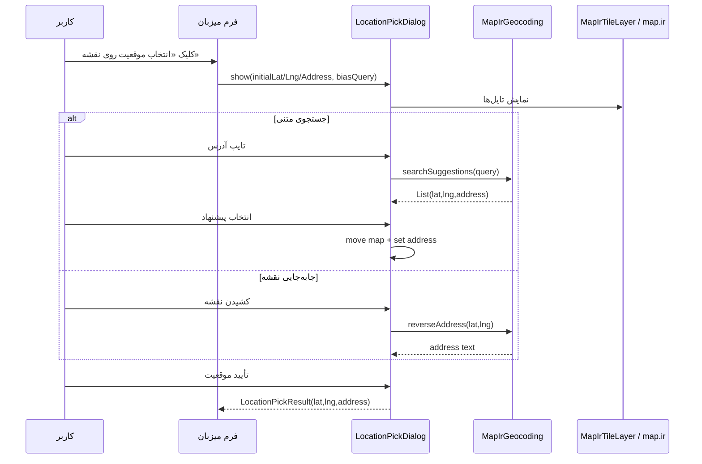

# راهنمای پیاده‌سازی انتخاب آدرس و لوکیشن (تحویل به توسعه‌دهنده)

این سند برای توسعه‌دهنده‌ای نوشته شده که می‌خواهد **همان قابلیت انتخاب موقعیت روی نقشه و دریافت آدرس فارسی** را در پروژهٔ Flutter دیگری پیاده کند.

دامنهٔ این سند فقط تا **خروجی نهایی** است:

```text
latitude  +  longitude  +  address (متن فارسی)
```

موضوعات خارج از دامنه (ذخیره در دیتابیس، ثبت پرونده، استان/شهرستان اتحادیه و …) عمداً پوشش داده نشده‌اند، مگر جایی که برای رسیدن به همین خروجی لازم باشند.

---

## ۱. هدف قابلیت

کاربر باید بتواند به یکی از دو روش زیر یک نقطه روی نقشه انتخاب کند و سیستم برایش **مختصات** و **آدرس متنی** بسازد:

| روش | رفتار |
|-----|--------|
| **جستجوی متنی** | تایپ بخشی از آدرس ← پیشنهادها ← انتخاب ← رفتن نقشه به آن نقطه + پر شدن آدرس |
| **جابه‌جایی نقشه** | کشیدن نقشه تا سنجاق ثابت وسط صفحه روی محل قرار بگیرد ← آدرس‌یابی معکوس |

خروجی قابل استفاده در هر فرم:

```dart
class LocationPickResult {
  final double latitude;
  final double longitude;
  final String address;
}
```

---

## ۲. معماری لایه‌ها

```
┌─────────────────────────────────────────────────────────┐
│  UI فرم / صفحهٔ میزبان                                   │
│  - دکمه «انتخاب موقعیت روی نقشه»                         │
│  - فیلدهای lat / lng / address (اختیاری در UI)           │
└──────────────────────────┬──────────────────────────────┘
                           │ LocationPickDialog.show(...)
                           ▼
┌─────────────────────────────────────────────────────────┐
│  LocationPickDialog                                      │
│  - جستجوی متنی + debounce                                │
│  - FlutterMap + سنجاق ثابت وسط                           │
│  - debounce حرکت نقشه → reverse geocode                  │
│  - تأیید → LocationPickResult                            │
└──────────────────────────┬──────────────────────────────┘
                           │
           ┌───────────────┴───────────────┐
           ▼                               ▼
┌─────────────────────┐         ┌─────────────────────┐
│ MapIrGeocoding      │         │ MapIrTileLayer      │
│ - autocomplete      │         │ - تایل raster map.ir│
│ - reverse           │         │ - fallback OSM      │
│ - fallback Neshan   │         └─────────────────────┘
└─────────────────────┘
           │
           ▼
┌─────────────────────┐
│ MapIrConfig         │
│ - API Key map.ir    │
│ - API Key Neshan    │
│ - URL تایل / timeout│
└─────────────────────┘
```

### فایل‌های مرجع در این ریپو

| فایل | نقش |
|------|-----|
| `lib/features/parvande_new/location_pick_dialog.dart` | UI دیالوگ انتخاب موقعیت |
| `lib/file_management/map_ir_geocoding.dart` | سرویس جستجو + reverse |
| `lib/file_management/map_ir_tile_layer.dart` | لایهٔ نمایش نقشه |
| `lib/file_management/map_ir_config.dart` | کلیدها و URLها |
| `lib/features/parvande_new/new_parvande_page.dart` | نمونهٔ اتصال دکمه به دیالوگ (فقط به‌عنوان مثال یکپارچه‌سازی) |

برای پروژهٔ جدید کافی است سه فایل اول + `map_ir_config` را کپی/بازنویسی کنید؛ صفحهٔ پرونده الزامی نیست.

---

## ۳. وابستگی‌های `pubspec.yaml`

حداقل پکیج‌های لازم:

```yaml
dependencies:
  flutter:
    sdk: flutter
  http: ^1.2.2
  flutter_map: ^6.2.1
  latlong2: ^0.9.1
```

| پکیج | کاربرد |
|------|--------|
| `flutter_map` | رندر نقشه و کنترل زوم/جابه‌جایی |
| `latlong2` | نوع `LatLng` برای مرکز نقشه |
| `http` | فراخوانی REST geocoding و دانلود تایل |

پس از افزودن:

```bash
flutter pub get
```

---

## ۴. تنظیمات و کلید API

فایل پیکربندی معادل `MapIrConfig`:

```dart
class MapIrConfig {
  /// توکن map.ir (از پنل map.ir بگیرید)
  static const apiKey = 'YOUR_MAP_IR_API_KEY';

  /// الگوی تایل raster رسمی map.ir برای flutter_map
  static String get tileUrlTemplate =>
      'https://map.ir/shiveh/xyz/1.0.0/Shiveh:Shiveh@EPSG:3857@png/{z}/{x}/{y}.png?x-api-key=$apiKey';

  static Map<String, String> get tileHeaders => {
        'x-api-key': apiKey,
        'User-Agent': userAgent,
        'Accept': 'image/png,image/jpeg,image/webp,image/*,*/*',
      };

  static Map<String, String> get apiHeaders => {
        'x-api-key': apiKey,
        'User-Agent': userAgent,
        'Accept': 'application/json',
      };

  static const geocodeTimeout = Duration(seconds: 10);
  static const userAgent = 'your_app_name/1.0';

  /// پشتیبان geocoding (اختیاری ولی توصیه‌شده)
  static const neshanApiKey = String.fromEnvironment(
    'NESHAN_API_KEY',
    defaultValue: 'YOUR_NESHAN_API_KEY',
  );
}
```

### نکات امنیتی برای توسعه‌دهنده

- کلیدها را در ریپوی عمومی hard-code نکنید؛ ترجیحاً از `--dart-define`، فایل env محلی یا remote config استفاده کنید.
- توکن map.ir در هدر `x-api-key` و گاهی در query تایل ارسال می‌شود.
- نشان با هدر `Api-Key` کار می‌کند.

### مستندات رسمی مرتبط

- نصب/تایل Flutter map.ir: https://help.map.ir/documentation/fluttersdk-installation/

---

## ۵. مدل دادهٔ خروجی

```dart
class MapIrLocationResult {
  const MapIrLocationResult({
    required this.latitude,
    required this.longitude,
    required this.address,
  });

  final double latitude;
  final double longitude;
  final String address;
}

/// خروجی دیالوگ برای فرم میزبان
class LocationPickResult {
  const LocationPickResult({
    required this.latitude,
    required this.longitude,
    required this.address,
  });

  final double latitude;
  final double longitude;
  final String address;
}
```

هر دو از نظر محتوا یکسان‌اند؛ جدا نگه داشتن آن‌ها برای جدا کردن لایهٔ سرویس از UI مفید است.

---

## ۶. سرویس Geocoding — قرارداد APIها

کلاس `MapIrGeocoding` (singleton) سه قابلیت عمومی دارد:

```dart
Future<MapIrLocationResult?> searchAddress(String query);
Future<List<MapIrLocationResult>> searchSuggestions(String query, {int limit = 8});
Future<String?> reverseAddress(double latitude, double longitude);
```

### ۶.۱ اولویت جستجوی متنی (Forward / Autocomplete)

1. **map.ir autocomplete**  
2. اگر خالی بود → **Neshan v6 geocoding**  
3. اگر باز هم خالی بود → **Neshan Plus geocoding**

#### map.ir — Autocomplete

```http
POST https://map.ir/search/v2/autocomplete
Headers:
  x-api-key: <MAP_IR_KEY>
  Content-Type: application/json
  Accept: application/json
Body:
  { "text": "<query>" }
```

پاسخ (خلاصهٔ فیلدهای مورد استفاده):

```json
{
  "value": [
    {
      "title": "...",
      "address": "...",
      "neighborhood": "...",
      "city": "...",
      "province": "...",
      "geom": {
        "coordinates": [longitude, latitude]
      }
    }
  ]
}
```

توجه: ترتیب مختصات GeoJSON است: **`[lng, lat]`**.

ساخت متن آدرس از فیلدهای غیرخالی: `address`، `title`، `neighborhood`، `city`، `province` با جداکنندهٔ `، `.

#### Neshan v6 — Geocoding

```http
GET https://api.neshan.org/v6/geocoding?address=<urlencoded query>
Headers:
  Api-Key: <NESHAN_KEY>
```

مختصات از:

```json
{ "location": { "x": <lng>, "y": <lat> } }
```

در پیاده‌سازی فعلی، متن آدرس برگشتی همان query ورودی است (Neshan v6 آدرس فرمت‌شدهٔ کامل برنمی‌گرداند در این مسیر).

#### Neshan Plus

```http
GET https://api.neshan.org/geocoding/v1/plus?json=<urlencoded json>
Headers:
  Api-Key: <NESHAN_KEY>
  Content-Type: application/json
```

بدنهٔ query تقریباً:

```json
{ "address": "<query>" }
```

از `items[0].location.latitude` / `longitude` و ترکیب `province`، `city`، `neighbourhood` برای آدرس استفاده می‌شود.

### ۶.۲ آدرس‌یابی معکوس (Reverse)

اولویت:

1. **map.ir reverse**  
2. **Neshan reverse v5**  
3. در نهایت برچسب مختصات: `مختصات: 35.689200, 51.389000`

#### map.ir reverse

```http
GET https://map.ir/reverse/?lat=<lat>&lon=<lng>
Headers:
  x-api-key: <MAP_IR_KEY>
```

فیلد متنی: `address`

#### Neshan reverse

```http
GET https://api.neshan.org/v5/reverse?lat=<lat>&lng=<lng>
Headers:
  Api-Key: <NESHAN_KEY>
```

فیلد متنی: `formatted_address`

### ۶.۳ تحمل خطا

- هر فراخوانی با `timeout` (پیش‌فرض ۱۰ ثانیه) و `try/catch` محافظت می‌شود.
- شکست یک provider کل جریان را متوقف نمی‌کند؛ به بعدی می‌رود.
- اگر همه fail شوند، reverse حداقل مختصات را به‌صورت متن برمی‌گرداند تا UI خالی نماند.

---

## ۷. لایهٔ نقشه (Tiles)

`MapIrTileLayer` یک `TileLayer` از `flutter_map` است با:

- `urlTemplate` رسمی map.ir (EPSG:3857 / XYZ)
- هدرهای `x-api-key`
- `maxZoom: 20`
- provider سفارشی که اگر تایل map.ir نامعتبر/خطا بود، به **OSM** fallback می‌کند:

```text
https://tile.openstreetmap.org/{z}/{x}/{y}.png
https://tile.openstreetmap.de/{z}/{x}/{y}.png
https://a.tile.openstreetmap.fr/hot/{z}/{x}/{y}.png
```

اگر همه fail شدند، یک PNG شفاف ۱×۱ برمی‌گرداند تا اپ کرش نکند (نقشه ممکن است خالی دیده شود).

> برای پروژهٔ جدید می‌توانید ابتدا فقط OSM بگذارید و بعد map.ir را وصل کنید؛ منطق انتخاب موقعیت مستقل از منبع تایل است.

---

## ۸. دیالوگ انتخاب موقعیت — رفتار دقیق UI

کلاس: `LocationPickDialog`

### ۸.۱ پارامترهای ورودی

```dart
static Future<LocationPickResult?> show(
  BuildContext context, {
  double? initialLat,
  double? initialLng,
  String initialAddress = '',
  String biasQuery = '',
})
```

| پارامتر | معنی |
|---------|------|
| `initialLat` / `initialLng` | مرکز اولیهٔ نقشه؛ اگر null باشد پیش‌فرض تهران `35.6892, 51.3890` |
| `initialAddress` | متن اولیهٔ کادر آدرس؛ اگر خالی باشد بلافاصله reverse برای نقطهٔ اولیه زده می‌شود |
| `biasQuery` | پیشوند جغرافیایی برای جستجو (مثلاً `فارس، شیراز`) تا نتایج محلی‌تر شوند |

`barrierDismissible: false` — بستن فقط با انصراف/تأیید.

### ۸.۲ جستجوی متنی

1. کاربر در `TextField` تایپ می‌کند.  
2. `Timer` با **۵۵۰ میلی‌ثانیه** debounce بعد از آخرین تغییر، جستجو را اجرا می‌کند.  
3. query مؤثر:

```text
اگر bias خالی نیست و داخل متن کاربر نیست:
  effectiveQuery = "{biasQuery}، {raw}"
وگرنه:
  effectiveQuery = raw
```

4. ابتدا با `effectiveQuery` پیشنهاد گرفته می‌شود؛ اگر خالی بود، یک‌بار فقط با `raw` تکرار می‌شود.  
5. حداکثر ۸ پیشنهاد در لیست؛ با `onTap` نقشه به آن نقطه با زوم **۱۶** منتقل می‌شود و آدرس پر می‌شود.

### ۸.۳ جابه‌جایی نقشه (سنجاق ثابت)

الگوی UX:

- آیکون `Icons.location_on` قرمز **وسط Stack** و `IgnorePointer` است (جابه‌جا نمی‌شود).
- کاربر نقشه را زیر سنجاق می‌کشد.
- در `onPositionChanged` یک debounce **۵۰۰ میلی‌ثانیه** ثبت می‌شود.
- پس از توقف: `camera.center` خوانده می‌شود → `_lat/_lng` به‌روز → `reverseAddress(lat, lng)` → پر شدن کادر «آدرس یافت‌شده».

زوم با دکمه‌های `+` / `−` کنار نقشه.

### ۸.۴ تأیید

دکمهٔ **تأیید موقعیت**:

```dart
Navigator.pop(context, LocationPickResult(
  latitude: _lat,
  longitude: _lng,
  address: _addressCtrl.text.trim(),
));
```

کاربر می‌تواند قبل از تأیید، متن آدرس را دستی ویرایش کند؛ همان متن ویرایش‌شده برمی‌گردد.

انصراف / بستن → `null`.

---

## ۹. یکپارچه‌سازی در پروژهٔ مقصد (حداقل کد)

### ۹.۱ باز کردن دیالوگ از یک دکمه

```dart
Future<void> openLocationPicker(BuildContext context) async {
  final result = await LocationPickDialog.show(
    context,
    initialLat: currentLat,      // یا null
    initialLng: currentLng,      // یا null
    initialAddress: currentAddress,
    biasQuery: 'تهران، تهران',   // اختیاری
  );

  if (result == null) return; // کاربر انصراف داد

  // از اینجا به بعد فقط همین سه مقدار را دارید:
  final lat = result.latitude;
  final lng = result.longitude;
  final address = result.address;

  // مثال: ریختن در کنترلرها / state
  // latController.text = lat.toStringAsFixed(6);
  // lngController.text = lng.toStringAsFixed(6);
  // addressController.text = address;
}
```

### ۹.۲ پیشنهاد UI فرم میزبان

- مختصات را **readOnly** بگذارید تا فقط از نقشه پر شوند.  
- دکمهٔ tonal با آیکون `Icons.map_outlined` کنار همان بخش.  
- فیلد آدرس چندخطی؛ بعد از برگشت از دیالوگ قابل ویرایش دستی بماند.

### ۹.۳ (اختیاری) مرکز اولیه بر اساس شهر

اگر در پروژهٔ خودتان نام استان/شهر دارید:

```dart
final hit = await MapIrGeocoding.instance.searchAddress('$state، $city');
if (hit != null) {
  initialLat = hit.latitude;
  initialLng = hit.longitude;
}
```

این فقط برای تجربهٔ بهتر است؛ برای رسیدن به آدرس/لوکیشن نهایی الزامی نیست.

---

## ۱۰. چک‌لیست پیاده‌سازی برای توسعه‌دهنده جدید

1. [ ] پکیج‌های `http`، `flutter_map`، `latlong2` اضافه شوند.  
2. [ ] کلید map.ir (و در صورت تمایل Neshan) در config قرار گیرد.  
3. [ ] `MapIrConfig` + `MapIrGeocoding` + `MapIrTileLayer` منتقل/بازنویسی شوند.  
4. [ ] `LocationPickDialog` با خروجی `LocationPickResult` پیاده شود.  
5. [ ] با اینترنت واقعی تست شود:
   - [ ] تایل نقشه لود می‌شود (یا fallback OSM)
   - [ ] جستجوی یک آدرس فارسی پیشنهاد می‌دهد
   - [ ] کشیدن نقشه آدرس reverse می‌سازد
   - [ ] تأیید سه مقدار lat/lng/address را برمی‌گرداند  
6. [ ] حالت آفلاین/خطای API بررسی شود (Timeout، کلید نامعتبر، لیست خالی).

---

## ۱۱. عیب‌یابی رایج

| مشکل | علت محتمل | اقدام |
|------|-----------|--------|
| نقشه سفید است | کلید تایل / قطعی شبکه | کلید map.ir را چک کنید؛ fallback OSM باید حداقل چیزی نشان دهد |
| جستجو خالی است | کلید API یا query خیلی کلی | کلیدها، و با `biasQuery` محدودتر جستجو کنید |
| reverse فقط مختصات می‌دهد | هر دو API reverse fail شده‌اند | لاگ statusCode، کلید، و دسترسی شبکه |
| debounce دیر حس می‌شود | تایمر ۵۰۰/۵۵۰ms | در صورت نیاز کم کنید؛ مراقب spam به API باشید |
| مختصات اشتباه جابه‌جا شده | اشتباه گرفتن lat/lng | در GeoJSON همیشه `coordinates[0]=lng` و `[1]=lat` |

---

## ۱۲. جریان خلاصه تا خروجی نهایی



در این نقطه کار «به‌دست‌آوردن آدرس و لوکیشن» تمام است؛ هر استفاده‌ای بعد از آن (ارسال به سرور، ذخیره پرونده و …) خارج از این سند است.

---

## ۱۳. کپی سریع ساختار پوشهٔ پیشنهادی در پروژهٔ مقصد

```text
lib/
  location/
    map_ir_config.dart
    map_ir_geocoding.dart
    map_ir_tile_layer.dart
    location_pick_dialog.dart
    location_pick_result.dart   # اختیاری؛ می‌تواند داخل dialog باشد
```

سپس از هر صفحه‌ای فقط `LocationPickDialog.show` را صدا بزنید و `LocationPickResult` را مصرف کنید.
